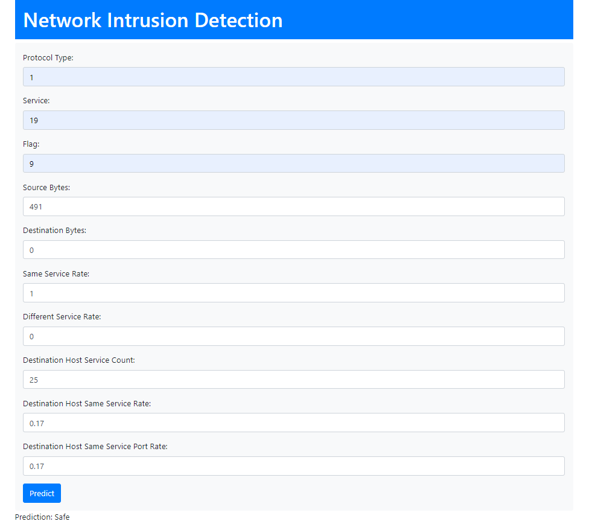
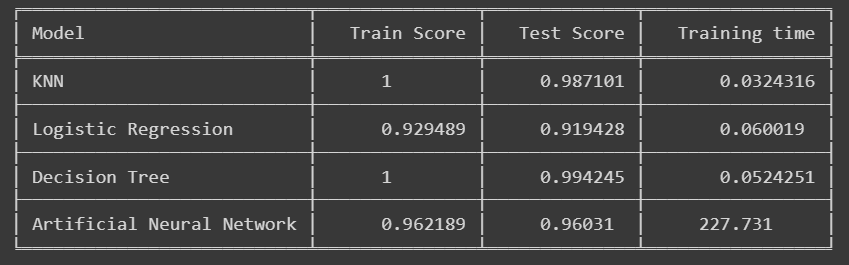

# Network Intrusion Detection System

## Introduction

Welcome to the Network Intrusion Detection System (NIDS) repository! This is where advanced cybersecurity techniques are put to use to safeguard your network from potential intrusions. The code in this repository showcases a robust NIDS designed to detect and respond to network threats effectively.

### Frontend:

### Performance Metrics:

## Table of Contents

- [Project Description](#project-description)
- [Installation](#installation)
- [Usage](#usage)
- [Acknowledgments](#acknowledgments)

## Project Description

The Network Intrusion Detection System is a critical cybersecurity project developed to protect networks from malicious activities and intrusions. This system employs cutting-edge algorithms to identify suspicious network behavior and react promptly to mitigate threats.

## Installation

To set up the Network Intrusion Detection System on your server, follow these steps:

1. Clone the repository to your server: `git clone https://github.com/YourOrganization/NIDS.git`.
2. Navigate to the project directory: `cd NIDS`.
3. Create a virtual environment (recommended): `python -m venv venv`.
4. Activate the virtual environment:
   - On Windows: `venv\Scripts\activate`
   - On macOS and Linux: `source venv/bin/activate`
5. Install the required dependencies: `pip install -r requirements.txt`.

## Usage

This repository contains the complete code for the Network Intrusion Detection System. To utilize this system for network security, please refer to the project's documentation. You can configure data sources and detection techniques to protect your network effectively.

## Acknowledgments

We would like to express our appreciation to the cybersecurity community for their insights and guidance, which have been invaluable in developing this NIDS. We also want to acknowledge the open-source threat intelligence feeds and data sources used in this project, which have been essential in training our detection algorithms and improving the system's effectiveness.

Together, we aim to enhance network security and protect against cyber threats using the power of modern cybersecurity technologies.
